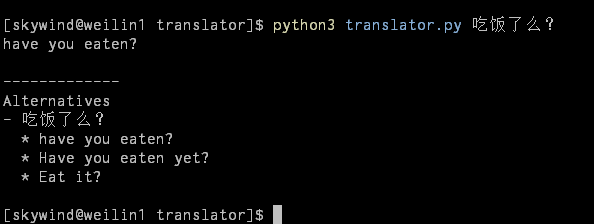
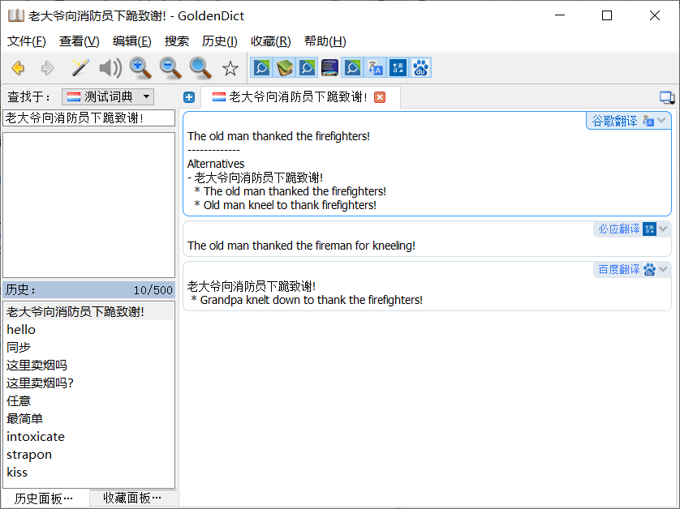
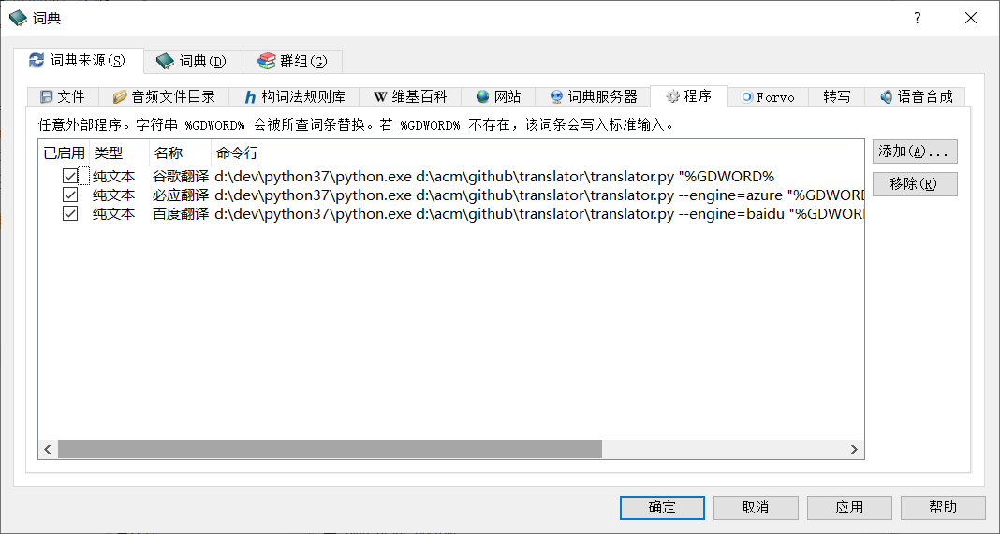

# Translator

命令行聚合翻译工具，支持谷歌，必应，有道，百度，词霸，360

## Preface

命令行翻译工具，可单独使用，可集成 Vim/Emacs，也可搭配 GoldenDict，之前用别人的命令行有道翻译，用着用着接口就挂了，网上找了两段百度翻译的代码，调试下发现接口已经过期。

最终找到一个桌面软件：QTranslate，同时支持十大翻译引擎，这个挂了可以用那个，这个翻译的不好可以看另外一个。所以我打算模仿一下 QTranslate，在命令行下面写这么一个东西，目标是：

- 支持代理：很多工具不支持代理，导致某些引擎就没法使用，所以代理是一等公民。
- 多种引擎：初期支持：谷歌，必应，有道，百度，词霸，360，并且不断更新。
- 同引擎多实现：官方接口（有的话），页面爬虫（如果官方接口要付费的话）。
- 三种输出：纯文本，HTML（方便集成字典），xterm（终端色彩高亮）。
- 可以方便的同 GoldenDict 等工具集成。

## Screenshots

### 命令行



### GoldenDict



同一个页面内同时集成多个翻译引擎，一次查询所有结果同时显示。

## Requirements

Python 3.5+ 以及 requests 库：

```bash
pip install requests
```

想要支持代理的话，安装 requests 的 socks 包：

```bash
pip install requests[socks]
```


## Configuration

配置位于 `~/.config/translator/config.ini`，内容类似：

```ini
# 所有翻译引擎共享的公共设置，比如网络超时，代理设置
[default]
timeout = 10

# 谷歌翻译 （使用国内可以访问的地址）
[google]
host = translate.google.cn

# 必应翻译
[bing]
proxy = socks5://localhost:1080

# 百度翻译：默认实现需要自行申请 apikey/secret
[baidu]
apikey = xxxxx
secret = xxxxx

# 百度：页面爬虫实现
[baidu-web]
xxx

```

## Usage

```bash
translator.py [--engine=引擎名称] [--from=语言] [--to=语言] {文字}
```

测试：

```bash
python translator.py 吃饭了没有?
```

输出：

```
Have you eaten yet?

-------------
Alternatives
- 吃饭了没有?
  * Have you eaten yet?
  * Eat yet?
```

测试：（有道引擎）

```bash
python translator.py --engine=youdao 吃饭了没有?
```

输出：

```
Have a meal not?
---------
have you eaten yet
```


## Engines

可以使用下面引擎

| 引擎名称 | 说明 | 标准接口 | 国内直连 | 需要 Key 吗 | 免费 | 状态 |
|---------|--------|--|--|--|--|--|
| google | 谷歌 | Yes | Yes* | No | 免费 | 完成 |
| azure | 微软 | Yes | Yes | **Yes** | 每月1万条内免费 | 完成 | 
| baidu | 百度 | Yes | Yes | **Yes** | 每月1万条内免费 | 完成 |
| youdao | 有道 | No | Yes | No | 免费 | 完成 | 
| bingdict | 必应词典（只能中英） | Yes | Yes | No | 免费 | 完成 |
| ciba | 词霸 | Yes | Yes | No | 免费 | 完成 |
| sogou | 搜狗 | Yes | Yes | No | 免费 | TODO |
| baiduweb | 百度 | No (爬虫) | Yes | No | 免费 | TODO |

说明：

- 微软 Azure 的翻译服务（必应），自己去 [Azure](https://portal.azure.com/) 申请一个免费 Key，每月 1 万次免费查询。
- 需要 APIKEY 的 Azure/Baidu 虽然初次使用麻烦，但是是官方标准 API，稳定性上超过其他。
- 谷歌翻译直接访问需要配置 config.ini 里的 host 或者代理。

## Tips

### 谷歌翻译的直接访问

默认使用 `translate.googleapis.com` 有时国内不一定能够直连，所以国内可以设置：

```ini
[google]
host = translate.google.cn
```

来修改 API 地址，或者使用：

```ini
[google]
proxy=socks5h://localhost:1080
```

来配置代理（如果你本机有的话），这里代理使用 `socks5h://` 的开头，这是 python requests 包里面的语法格式，多了一个 `h` 意思是域名也送给代理解析，本地不解析域名。

### 密钥申请

- Azure：用微软账户开通 [Azure](https://portal.azure.com)，然后添加 Microsoft Translator 服务，然后得到免费 KEY，不会可以看 [教程](https://ordasoft.com/News/SEF-Translate-Documentation/how-to-get-bing-translate-api.html)。
- 百度：到 [百度翻译开放平台](http://api.fanyi.baidu.com/api/trans/product/index)，申请开通。

### 词典集成

要集成 GoldenDict，先在命令行下测试 Python 可以顺利运行该脚本，然后设置你的词典：



按 F3 打开词典设置，然后点 “程序”，选择 “纯文本”，后面是名字和运行命令，最后是图标路径（图标请自己下载）。

你想要同时展示多少个翻译引擎就配置多少行命令。


## Credit

逐步完善添加

